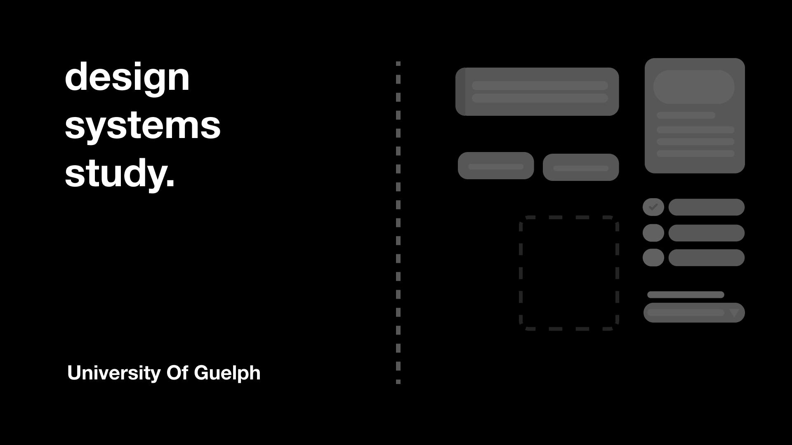

# Design System Study



At what point do design systems become viable for organizations to
implement? What does the future of design systems look like? To answer these questions this
study at the University of Guelph's School of Computer Science will set out to interview those who build, maintain, or use design systems across a variety of
organization sizes.

**This repo contains the code for the public facing website for this study. If you'd like to participate in the study or would like more information, please visit the website:** [designsystemstudy.ca](https://designsystemstudy.ca)

## Developing

Once you've created a project and installed dependencies with `npm install` (or `pnpm install` or `yarn`), start a development server:

```bash
npm run dev

# or start the server and open the app in a new browser tab
npm run dev -- --open
```

## Building

To create a production version of your app:

```bash
npm run build
```

You can preview the production build with `npm run preview`.

> To deploy your app, you may need to install an [adapter](https://kit.svelte.dev/docs/adapters) for your target environment.
